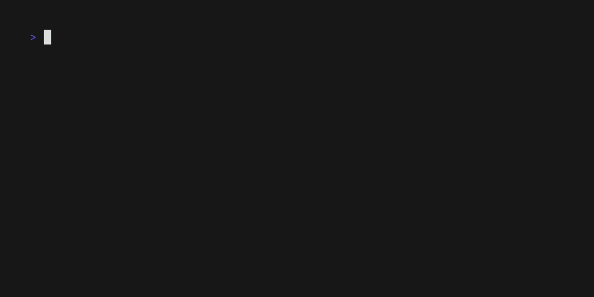

# Parallel Boruvka's Algorithm

This project implements a parallel version of Boruvka's algorithm using MPI and OpenMP to find the Minimum Spanning Tree (MST) of a graph.

## Features
- Parallel execution using MPI and OpenMP for improved performance on large graphs.
- Ability to generate random graphs or use custom input files.
- Debugging support for easier troubleshooting.

## Prerequisites
- MPI library.
- OpenMP support in your compiler

## Compilation

The code can be compiled using the provided `Makefile`. To compile the project, run:

```bash
make
```

### Custom Compilation Options
You can customize the compilation process by passing the following options to `make`:

- `GEN=<num>`: Generate a random graph with `<num>` vertices and edges. Default is `0`, which means a preexisting `graph.txt` file will be used.
- `MAX=<num>`: Set the maximum weight for random edge generation. Default is `50000`.
- `MIN=<num>`: Set the minimum weight for random edge generation. Default is `1`.
- `INPUT=/path/to/file`: Specify a custom input file. Default is `graph.txt`. If `GEN` and `SAVE` are set, this file will be used to save the generated graph.
- `OUTPUT=/path/to/file`: Specify a custom output file. Default is `mst.txt`. This file will contain the resulting MST. The option `SAVE` must be set to `1` to save the MST.
- `SAVE=1`: Save the generated *graph* to `INPUT` and the resulting *mst* to `OUTPUT`. Default is `0`.
- `NP=<num>`: Set the number of processes for MPI execution. Default is `1`.
- `DEBUG=1`: Compile with debugging prints enabled.

## Running the Program

After compiling, you can run the program through the `make` command:

### Using `make`
```bash
make run NP=<procs> GEN=<num> MIN=<num> MAX=<num> INPUT=/path/to/file OUTPUT=/path/to/file SAVE=1
```

The `run` target will automatically clean previous builds before executing the program.

## Debugging

To compile the code with debugging prints, use the `debug` target:

```bash
make debug
```

You can still use all other options with the `debug` target.

This is an example of the debugging output:

```bash
[0.067073] 0: Graph loaded.
[0.071692] 1: Graph broadcasted. V = 1000, E = 499500
[0.071715] 1: V = 1000, E = 499500
[0.073610] 2: Graph broadcasted. V = 1000, E = 499500
[0.073630] 2: V = 1000, E = 499500
[0.073653] 2: Starting Boruvka...
[0.073618] 3: Graph broadcasted. V = 1000, E = 499500
[0.073640] 3: V = 1000, E = 499500
```

## Cleaning Up

To remove compiled object files and the executable, run:

```bash
make clean
```

## Example Usage

1. **Generate a random graph with 100 vertices, with different weights range:**
   ```bash
   make run NP=4 GEN=100 MIN=10 MAX=100
   ```

2. **Use a custom input file:**
   ```bash
   make run NP=4 INPUT=/path/to/custom_graph.txt OUTPUT=/path/to/output_mst.txt
   ```

3. **Compile with debugging enabled, with other options:**
   ```bash
   make debug NP=2 GEN=5000 MAX=1000

4. **Compile with debugging enabled, generate a random graph, and save the generated graph and MST to custom locations:**
    ```bash
    make debug NP=4 GEN=1000 MIN=10 MAX=100 SAVE=1 INPUT=/path/to/custom_graph.txt OUTPUT=/path/to/output_mst.txt
   ```

### Demo video


## License

This project is licensed under the GPL-3.0 License. See the LICENSE file for more details.
